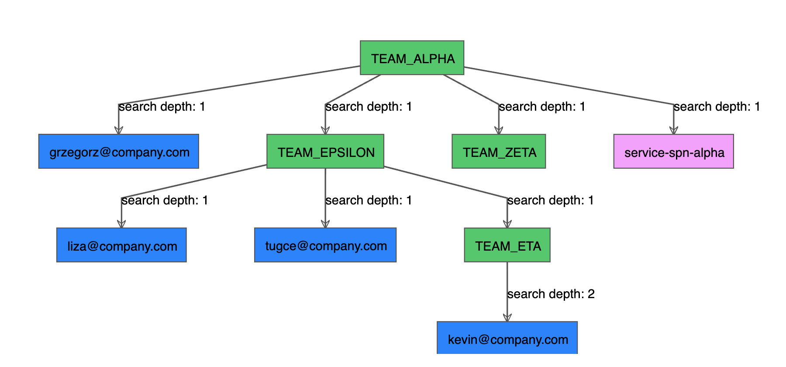

# Azure AAD to Databricks Account SCIM Sync

An example of end to end synchronization of the whitelisted Azure Active Directory groups and their members into the Databricks Account.

This python based application supports synchronization of:

- Users
- Service Principals
- Groups and their members

Group members can be any of the above, and yes, that means that group in a group, a.k.a. **nested groups are supported**!

Synchronization principles:

- When doing synchronization no security principals (users, service principals or groups) are ever deleted.
- Synchronization only adds new security principals, or updates their attributes (like display name, or active flag) of already existing ones.
- Group members are fully sychronized to match what is present in AAD. Any new groups members are automatically added to databricks account.
- Optionally deep group search is possible to extend the list of synced groups by doing recursive searches.
- By default incremental/change feed is used, hence only AAD/Entra groups that have changed since last runare being synced to Databricks! This reduces reduces synchronization time dramatically.
- When incremental is used for a first time, the full sync is performed, consequitve runs will be just incrementals.

## Nested groups search

It is possible to deep search group members for additional groups to sync by adjusting `--group-search-depth` parameter.

Default value of `1` means that only groups defined in the input file would be synced, value of `2` would mean that child groups of these groups would be searched and synced as well.

For example, searching groups `TEAM_ALPHA`, `TEAM_EPSILON`, `TEAM_ZETA` with `--group-search-depth` set to `2` will result in following result:


Observe that directly searched groups will always have `search depth` equal to `1`, only the child group member `kevin@company.com` is being found because of the deep/recursive search over group `TEAM_ETA`

There is no hard depth limit, but **caution** has to be exercised when using this parameter, because too deep search can cause too many groups to be discovered and in effect platform limits will be hit.

It it advised to first run `--query-graph-only` and `--save-graph-response-json results.json` parameters together in order to inspect the groups discovered during the deep search. And only continue with sync if results are below the maximum number of groups SCIM endpoint supports!

## Incremental synchronization (default)

Uses Graph API change feed to determine the groups that have changed since last run. In this mode, all previously synchronized groups will be checked for changes. That means that groups that changed in AAD/Entra, but never were requested to be synced will be ignored.

In scenario where incremental sync is ran for specific group(s) for the first time, the full synchronization of specific groups(s) is automatically performed in order to capture all the memembers of a group.

Hence this default mode is handing both situation where initial sync needs to be done, or consequtive groups changes needs to be synced.

To run the incremental sync follow these steps:

- Authenticate: [Authentication steps described in section below](#authentication)
- (Optionally) For the first run, create `json` file containing the list of AAD groups names you would like to add to sync, and save it to `groups_to_sync.json` (for reference, see `examples/groups_to_sync.json`). 
- Run sync with dry run first: `azure_dbr_scim_sync --dry-run-security-principals --dry-run-members --full-sync`.
  - (optionally) add `--groups-json-file groups_to_sync.json` to use the file with groups, consequtive runs don't need this file anymore.
- To get more information about the process add:
  - `--verbose` (logs information also about identities that did not change, by default only changes are logged) 
  - or `--debugg` (very detail, incl. api calls)
- Follow the prompts on the screen with regards to how to proceed with the [dry run](#dry-run-sync) levels.
  - If suggested list of changes look like what you would expect run without proposed `--dry-run-...` parameter(s)
- Repeat the steps again, but on bigger list of groups by adding more groups to `groups_to_sync.json` and run the process with `--groups-json-file` parameter.

Some technical facts:

- Internally all cached groups (contents of `cache_groups.json`) are used to determine the names of groups for syncing.
- When optional `--groups-json-file <file>` parameter is provided, any new groups defined will be fully synced on a first run. Groups that are already in cache wont have any significance, hence it's allowed to execute command perpectually with the same file, and it will have no effect on consequtive runs.
- Graph API incremental token is saved in `graph_incremental_token.json` file after each successfull sync. Deleting this file will cause full sync.

## Full synchronization (`--full-sync`)

Synchronizes all provided groups in the `--groups-json-file <file>`, without using change feed. The list of groups for syncing can vary from one run to other, hence it's possible to just selectively sync few groups at a time, or run sync of all the groups in scope of your application. It goes without saying that sync of 5 groups (and their members) will take few seconds, while syncing of all users, service principals, and groups, can take tens of minutes/hours. Normally there is no good reason to run this sync often.

To run th full sync, follow [Incremental synchronization](#incremental-synchronization-default), and add `--full-sync` patameter to force full syncsynchronization.

## Mixed Sync

It is allowed to switch between incremental and full synchronization modes at will, for example there are two usecases/patterns I have observed:

- Full sync of newly to be onboarded groups, usually of adhoc nature, always needed when onboarding a new team to Unity Catalog. Normally you would like to sync all team groups and their members before running the onboarding process. This way that all the access could be set by your CI/CD automation (looking at you here [databricks terraform provider](https://registry.terraform.io/providers/databricks/databricks/latest/docs)). Without doing this step automation would most likely fail because the groups or other identities would not be yet presentin databricks account.
- Incremental sync, running on a schedule every few hours/minutes, that will be synchronizing all previously synced groups.

The interface to faciciliate these two usecases is the same, the only difference are:

- full sync required `--full-sync` parameter, while incremental require its absence.
- the list of groups:
  - full sync uses the provided groups `--groups-json-file <file>`
  - while incremental uses list of previously synced groups, if `--groups-json-file <file>` is provided, the new groups will be handled as if they were fully synced
- trigger:
  - full sync, due to performance reasons should be in adhoc nature.
  - incremental sync, due to being fast, should be run on a schedule basis (every 30 minutes or every 1h).

Reference of command line:

```shell
$ ✗ azure_dbr_scim_sync --help
Usage: azure_dbr_scim_sync [OPTIONS]

Options:
  --groups-json-file TEXT         list of AAD groups to sync (json formatted)
                                  [required]
  --verbose                       verbose information about changes
  --debug                         more verbose, shows API calls
  --dry-run-security-principals   dont make any changes to users, groups or
                                  service principals, just display pending
                                  changes
  --dry-run-members               dont make any changes to group members, just
                                  display pending membership changes
  --worker-threads INTEGER        number of concurent web requests to perform
                                  against SCIM  [default: 10]
  --save-graph-response-json TEXT
                                  saves graph response into json file
  --query-graph-only              only downloads information from graph (does
                                  not perform SCIM sync)
  --group-search-depth INTEGER    defines nested group recursion search depth,
                                  default is to search only groups provided as
                                  input  [default: 1]
  --help                          Show this message and exit.
```

### Dry run sync

The sync tool offers two dry run modes, allowing to first see, and then approve changes:

- `--dry-run-security-principals`: allows to see which users, service principals and groups (not members!) would be added, or changed. At this point, if any changes are present the group membership synchronization will be skipped, and only can be continued once changes are applied.
- `--dry-run-members`: applies any pending changes from above, and displays any group members that would be added or removed. In order to apply group members changes, run without any dry run modes.

## Authentication

Sync tool needs authentication in order to connect to **AAD**, **Azure Databricks Account**, and **Azure Datalake Storage Gen2** for cache purpose.

It's highly recommended to first trying running the tool from your local user account, directly from your laptop/pc/mac/rasperypi :) and once it works switch over to devops and there run it as service principal. 

The authentication is decoupled from the sync logic, hence it's possible to change way of authentication (user vs. service principal auth) via change of enviroment settings/variables without need of changing any code. Please read more about it in respective sections below.

### Azure Active Directory or Entra (via graph API) Authentication

The list of security permission you will need:

- [User.Read.All](https://learn.microsoft.com/en-us/graph/permissions-reference#userreadall): gives access to read all the users

- [Group.Read.All](https://learn.microsoft.com/en-us/graph/permissions-reference#groupreadall): giving access to read all the group members

- [Application.Read.All](https://learn.microsoft.com/en-us/graph/permissions-reference#applicationreadall): giving access to read all the service principals
- or more broad [Directory.Read.All](https://learn.microsoft.com/en-us/graph/permissions-reference#directoryreadall): giving access to read all objects in AAD

In most - non heavy regulated - organizations, any user is by default given access to read whole AAD (this may vary if you are a contractor). Service Principals by default have no such access, hence request needs to be filed in in order to run the tool from devops.
  
The easiest way to check if your user account has access, is to go to [Azure Portal](http://portal.azure.com) and look for `Microsoft Entra ID`, there on the left, you should see `Users`, `Groups` and `App registrations`. If you are allowed to browse and use search funcitonality, that means that your user has all the needed access to query graph API!

To check if service principal has enough rights, please find your service principals inside of the `App registrations` and then click on the `API permissions` button on the left. In the blade on the right you should see list of the permissions, and status. If permissions are not listed there, or status says `Not granted...` that means you need to request access for your service principal.

Auth uses `azure-identity` python package which offsers [variety of authentication methods](https://learn.microsoft.com/en-us/python/api/overview/azure/identity-readme?view=azure-python#defaultazurecredential), the two common ones used are:

- **Azure CLI**, allowing user to authenticate via device code, or via browser auth. Without need of storing any credentials in enviroment, or any config files. This is the best practice method for authentication from local machine.

  - Make sure that you are authenticated to correct tenant in [Azure Portal](http://portal.azure.com)
  - To 'authenticate' the shell, run: `az login --tenant <TenantID>`. The auth **might** work if you just run `az login`, but then you may face issues with MFA related errors when you user account has access to multiple azure tenants.
  - Azure CLI installation manual: [macOS](https://learn.microsoft.com/en-us/cli/azure/install-azure-cli-macos), [windows](https://learn.microsoft.com/en-us/cli/azure/install-azure-cli-windows?tabs=azure-cli), [linux](https://learn.microsoft.com/en-us/cli/azure/install-azure-cli-linux?pivots=apt). `azure devops` hosted agents have it already preinstalled.
  - Troubleshoot auth errors:
    - Once authenticated, run `az account get-access-token --resource https://graph.microsoft.com/`, it should return `json` document with token. If you get MFA errors make sure you include  `--tenant` parameter in your `az login`
    - If you see may see `jwt ... token` related errors, this usually can be fixed by cleaning login cache `az cache purge`

- **Environment** allowing authentication of service principals via environment variables. Auth method mainly used in devops. Set following [variables](https://learn.microsoft.com/en-us/python/api/overview/azure/identity-readme?view=azure-python#environment-variables):
  - `AZURE_TENANT_ID` - ID of the application's Microsoft Entra tenant
  - `AZURE_CLIENT_ID` - ID of a Microsoft Entra application
  - `AZURE_CLIENT_SECRET` - one of the application's client secrets

- **DeviceCodeAuth**, allows using interactive [device code authentication](https://learn.microsoft.com/en-us/python/api/azure-identity/azure.identity.devicecodecredential?view=azure-python). Set following variables:
  - `AZURE_TENANT_ID` - ID of the application's Microsoft Entra tenant
  - `AZURE_CLIENT_ID` is set to literal string `DeviceCodeAuth`
  - `AZURE_CLIENT_SECRET` is set to literal string `DeviceCodeAuth`

The Environment variables take precedence over the Azure CLI auth.

### Databricks Account Authentication

You need to be logged in as [Account admin](https://docs.databricks.com/en/administration-guide/users-groups/index.html#who-can-manage-identities-in-databricks) in order to modify the identities in databricks account.

In most cases - if you are reading this manual - you should be already account admin. If in doubt, the easiest way to check if you are the admin is to go to [Account Console](https://accounts.azuredatabricks.net/) - if you are able to log in, you are admin

Auth uses `databricks-sdk` python package which offers [variety of authentication methods](https://github.com/databricks/databricks-sdk-py#authentication), the two common ones used are:

- **Azure CLI**, refer to section above (ADD auth) for details
  - Once logged in, additionally you will need to configure two environment variables:
    - `DATABRICKS_ACCOUNT_ID` - the ID of your databricks account (you can find it in [Account Console](https://accounts.azuredatabricks.net/))
    - `DATABRICKS_HOST` - endpoint url, static value always pointing to `https://accounts.azuredatabricks.net/`
  - Troubleshoot auth errors:
    - Once authenticated, run `az account get-access-token --resource 2ff814a6-3304-4ab8-85cb-cd0e6f879c1d` (the `2f...c1d` is the ID of Azure Databricks Service, [not a secret value in anyway](https://learn.microsoft.com/en-us/azure/databricks/dev-tools/service-prin-aad-token#--get-a-microsoft-entra-id-access-token-with-the-azure-cli)), it should return `json` document with token. If you get MFA errors make sure you include  `--tenant` parameter in your `az login`.
- **Environment** allowing authentication of service principals via environment variables. Auth method mainly used in devops. Set following [variables](https://github.com/databricks/databricks-sdk-py#azure-native-authentication):
  - `DATABRICKS_ACCOUNT_ID` - see azure cli section
  - `DATABRICKS_HOST` - see azure cli section
  - SPN auth:
    - `ARM_TENANT_ID` - ID of the application's Microsoft Entra tenant
    - `ARM_CLIENT_ID` - ID of a Microsoft Entra application
    - `ARM_CLIENT_SECRET` - one of the application's client secrets
  - SCIM Token auth:
    - `DATABRICKS_TOKEN` - SCIM Token generated from "Account Console" -> "Settings" -> "User provisioning" page.

The Environment variables take precedence over the Azure CLI auth.

## Azure Datalake Storage Gen2 (cache storage) Authentication

Sync tools uses cache of translation of AAD/Entra object IDs (example: 748fa79a-aaaa-40a5-9597-1b50cbb9a392) to Databricks Account object IDs (1236734578586). This cache is automatically maintained and is self healing, hence it does not have any side effects except allowing scim sync tool to run 10x faster with it, than without.

For storing the cache tools needs to have access to a container and optionally a subfolder, where it can write it's cache files.

Auth uses `azure-identity` python package which offers [variety of authentication methods](https://learn.microsoft.com/en-us/python/api/overview/azure/identity-readme?view=azure-python#defaultazurecredential), the two common ones used are:

- **Azure CLI**, refer to section above (ADD auth) for details:
  - Once logged in, additionally set two environment variables:
    - `AZURE_STORAGE_ACCOUNT_NAME` - the name of the azure storage account, for example: `myscimsync`
    - `AZURE_STORAGE_CONTAINER` - the name of the container, for example: `data`. The name can be followed by a subfolder for example `data\some\folder` will cause cache to be written to container `data` and then placed in `some\folder` folder
- **Environment** allowing authentication of service principals via environment variables. Auth method mainly used in devops. Set following [variables](https://github.com/fsspec/adlfs#setting-credentials):
  - `AZURE_STORAGE_ACCOUNT_NAME` - see azure cli section
  - `AZURE_STORAGE_CONTAINER` - see azure cli section
  - `AZURE_STORAGE_TENANT_ID` - ID of the application's Microsoft Entra tenant
  - `AZURE_STORAGE_CLIENT_ID` - ID of a Microsoft Entra application
  - `AZURE_STORAGE_CLIENT_SECRET` - one of the application's client secrets

The Environment variables take precedence over the Azure CLI auth.

## Building a package / Local development

Currently package for this code is not being distributed, you need to build it yourself, follow these steps to do so:

- run `make dev` (will put you in `.venv`)
- run `make dist`
- in `dist` folder package placed will be
- run `make install` to install the package locally
- if you are in `.venv`, you should be able to run `azure_dbr_scim_sync --help`
- if you are not in `.venv` follow on screen instructions regarding placement of the CLI command

## Running directly from databricks notebook

It is possible to run the sync code directly from databricks notebook, in order to do so, please either:

- install the wheel file on a cluster / session scope notebook
- use [files in repos](https://www.databricks.com/blog/2021/10/07/databricks-repos-is-now-generally-available.html) or [workspace files](https://docs.databricks.com/en/delta-live-tables/import-workspace-files.html) functionality to `import azure_dbr_scim_sync`

Ensure that notebook dependencies are installed
```python
%pip install pydantic==2.3.0 pyyaml==6.0.1 databricks-sdk==0.9.0 requests click==8.1.7 coloredlogs==15.0.1 joblib fsspec==2023.9.2 adlfs==2023.9.0 azure-identity==1.15.0 ipydagred3 networkx
dbutils.library.restartPython()
```

### Enable logging when running from notebook
```python
import logging
import sys
import os
import coloredlogs

# debug and verbose can be very chatty
# dial down to verbose=True (or False)
# debug=False to more readable output
verbose = False
debug = False

logging.basicConfig(stream=sys.stdout,
                        level=logging.INFO,
                        format='%(asctime)s %(levelname)s %(threadName)s [%(name)s] %(message)s')
logger = logging.getLogger('sync')

# colored logs sets all loggers to this level
coloredlogs.install(level=logging.DEBUG)
logging.getLogger().setLevel(logging.DEBUG if debug else logging.INFO)
logging.getLogger('py4j').setLevel(logging.ERROR)
logging.getLogger("azure.core.pipeline.policies.http_logging_policy").setLevel(
    logging.DEBUG if debug else logging.WARNING)

if verbose:
    logger.setLevel(logging.DEBUG)
```

### Query graph api from notebook

```python
from azure_dbr_scim_sync.graph import GraphAPIClient

# force using device auth code
os.environ.setdefault('AZURE_CLIENT_ID', 'DeviceCodeAuth')
os.environ.setdefault('AZURE_CLIENT_SECRET', 'DeviceCodeAuth')

# mind that you will be asked for device login each time you run this
# hence for repeated runs split this command into two
graph_client = GraphAPIClient()

# split here :)
aad_groups = [ "TEAM_ALPHA", "TEAM_EPSILON", "TEAM_ZETA" ]

# you can use graph_client at will now
# use graph_client._session to make vanilla http requests
data = graph_client.get_objects_for_sync(aad_groups, 2)
data
```

### Display graph api results in nice graph like notebook visualization

```python
import ipydagred3
G = ipydagred3.Graph(directed=True)

for _, u in data.users.items():
  G.setNode(u.id, label=u.mail, style="fill: #0080FF")

for _, g in data.groups.items():
  G.setNode(g.id, label=g.display_nam], style="fill: #00CC66")

for _, s in data.service_principals.items():
  G.setNode(s.id, label=s.display_name, style="fill: #FF99FF")

for _, g in data.groups.items():
  for _, m in g.members.items():
    G.setEdge(g.id, m.id, label=f"search depth: {m.extra_data['search_depth']}")

widget = ipydagred3.DagreD3Widget(graph=G)
widget
```

### Run SCIM sync into databricks from notebook

```python
from azure_dbr_scim_sync.scim import get_account_client

os.environ.setdefault('DATABRICKS_ACCOUNT_ID', '...')
os.environ.setdefault('DATABRICKS_HOST', 'https://accounts.azuredatabricks.net')
os.environ.setdefault('DATABRICKS_TOKEN', 'dsapi...')

account_client = get_account_client()

# test connectivity
account_client.groups.list()

# pushes objects to SCIM
sync_results = sync(
    account_client=account_client,
    users=[x.to_sdk_user() for x in data.users.values()],
    groups=[x.to_sdk_group() for x in data.groups.values()],
    service_principals=[x.to_sdk_service_principal() for x in data.service_principals.values()],
    deep_sync_group_names=list(data.deep_sync_group_names),
    dry_run_security_principals=False,
    dry_run_members=False,
    worker_threads=10)

# show sync results
# you may want to save it into delta table for analytical purposes!
sync_results
```

## Limitations

- Inactive AAD Users and Service Principals are only inactivated in Databricks Account when they are being synced, as in being member of the group that is being synced. For example, if dis-activated user gets also removed from the groups, then this user wont be taking part of sync anymore, and due to this this user wont be deactivated in Databricks Account.
  - Workaround for this is to disable User or Service Princial in AAD and keep them as members of groups they used to be in. This way next full sync will disable them in account console.

## Near time roadmap

- enable incremental graph api change feed(https://learn.microsoft.com/en-us/graph/webhooks), so that only group members and users/spns who changed since last ran would be synced
- enable logging of changes into JSON and DELTA format (running from databricks workflow would be required)
- enable ability to run directly from databricks workflows, with simple installer

